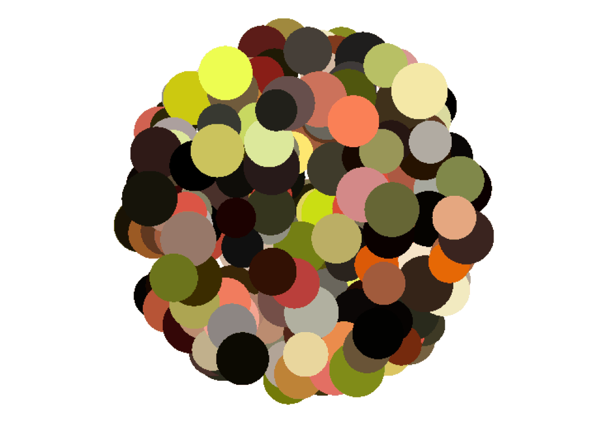
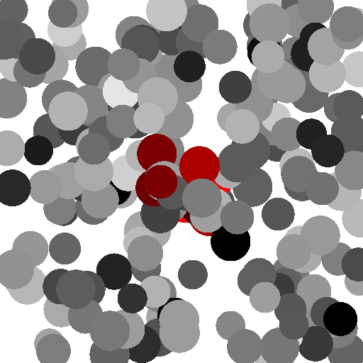

# Dead Leaves

```{include} ../README.md
:start-line: 3
:end-line: 4
```

:::::{card}
:text-align: center
:width: auto
:margin: 3
:link: gallery/index.html

::::{grid} 10
:margin: 0
:padding: 0
:gutter: 1





::::
:::::

Core features are
```{include} ../README.md
:start-line: 13
:end-line: 19
```

---

::::{grid} 2 
:gutter: 3

:::{grid-item-card} Get started 
:link: getting_started/installation 
:link-type: doc 
:text-align: center 
🚀 
^^^

Install `deadleaves` and follow an introductory tutorial 
:::

:::{grid-item-card} Learn more 
:link: user_guides/index 
:link-type: doc 
:text-align: center 
👨‍💻 
^^^

Learn more about design decisions and particular conventions and topics within `deadleaves` 
:::

:::{grid-item-card} Reference 
:link: reference/deadleaves/index 
:link-type: doc 
:text-align: center 
📖 
^^^

Look up functions and their specific parameters
:::

:::{grid-item-card} Get in touch, or contribute 
:link: development/contributing 
:link-type: doc 
:text-align: center 
📨, 🎁 
^^^

Ask a question, report a bug, request a feature, or contribute. 
::: 
::::

```{toctree}
:hidden:
:maxdepth: 2
:caption: Contents

getting_started/index
user_guides/index
Gallery <gallery/index>
Reference <reference/deadleaves/index>
Development <development/contributing>
```