# Dead Leaves

```{include} ../README.md
:start-line: 3
:end-line: 4
```

:::::{card}
:text-align: center
:width: auto
:margin: 3
:link: gallery/index.html

::::{grid} 10
:margin: 0
:padding: 0
:gutter: 1
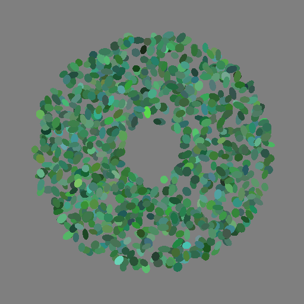

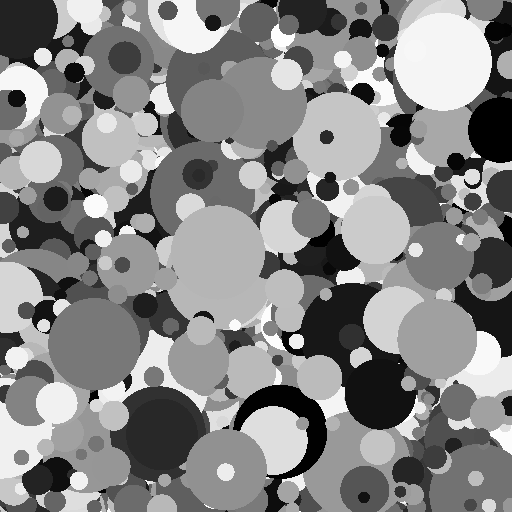

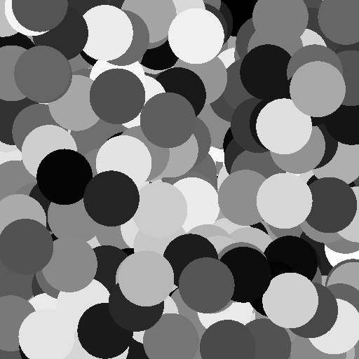

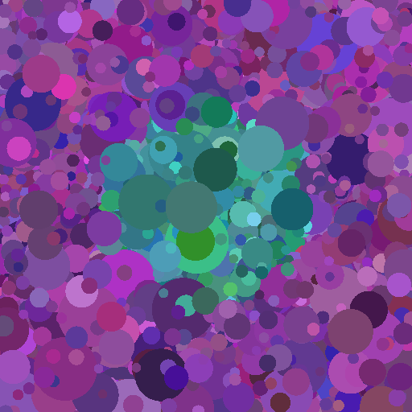

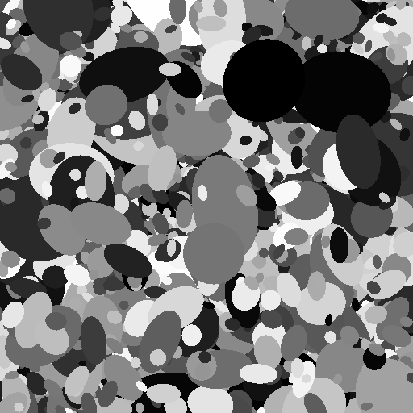

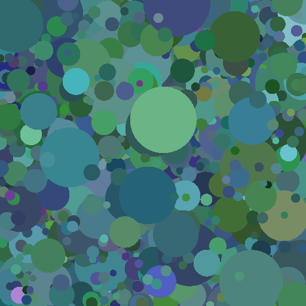

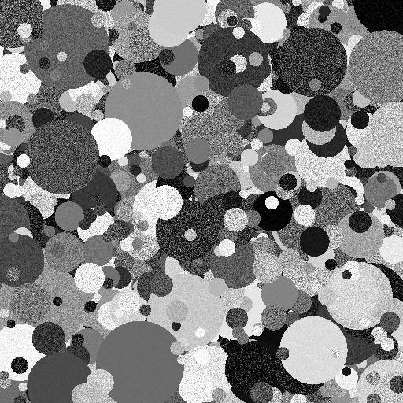

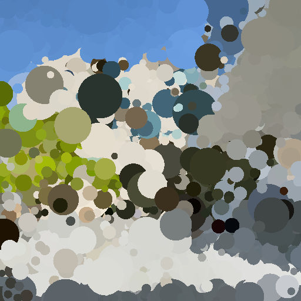

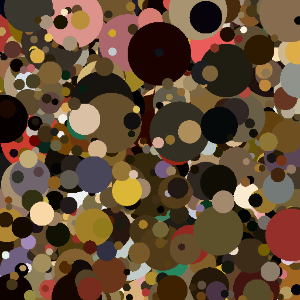

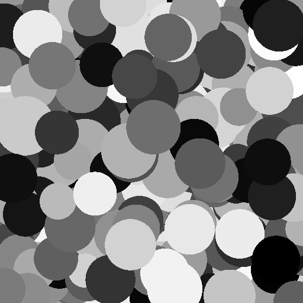

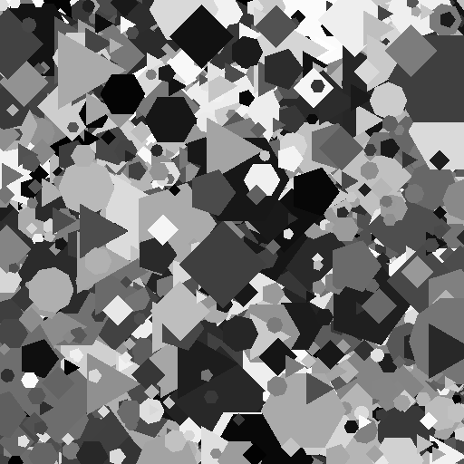

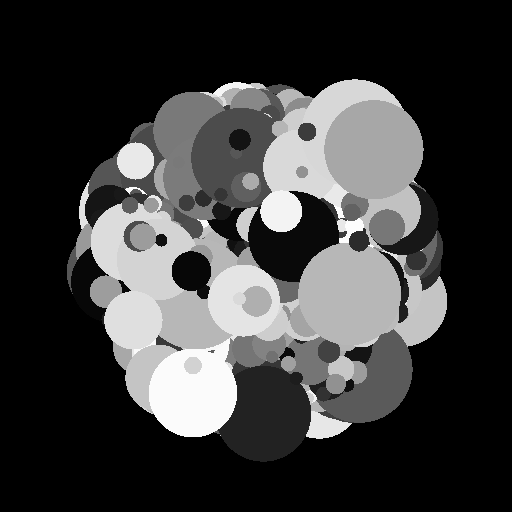

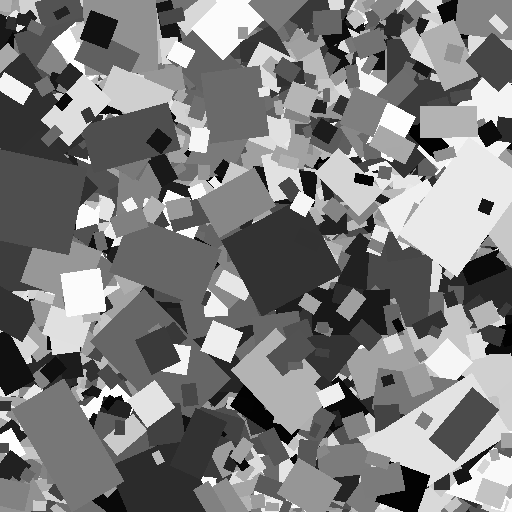

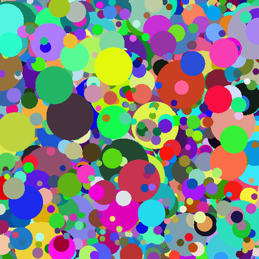

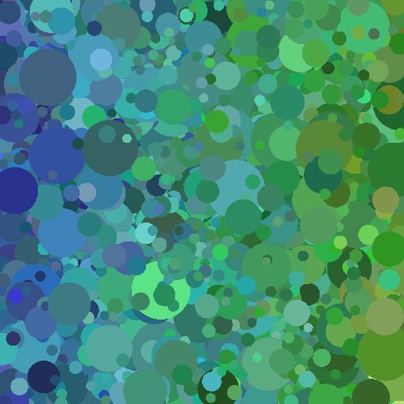

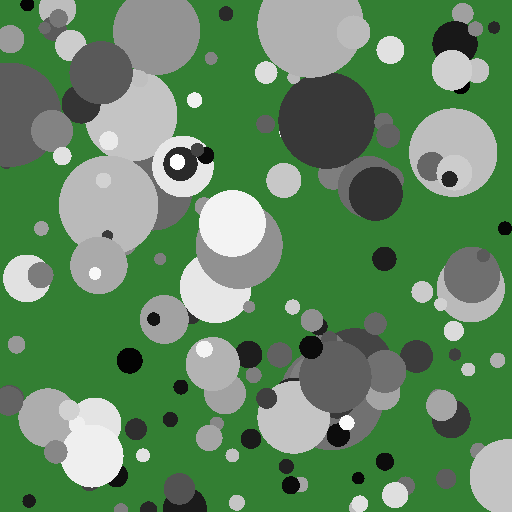

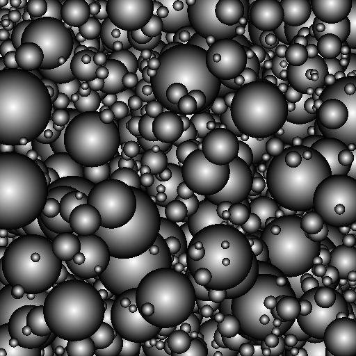

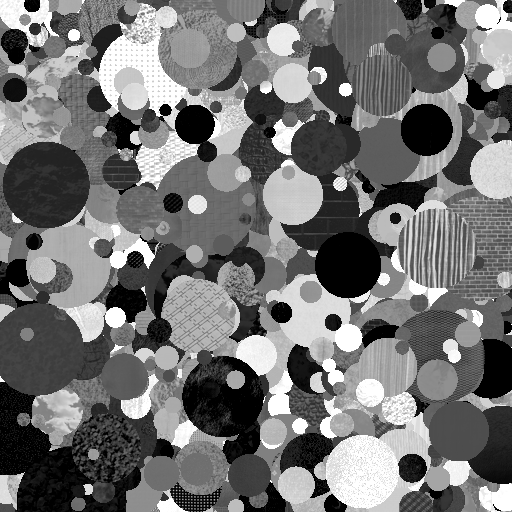

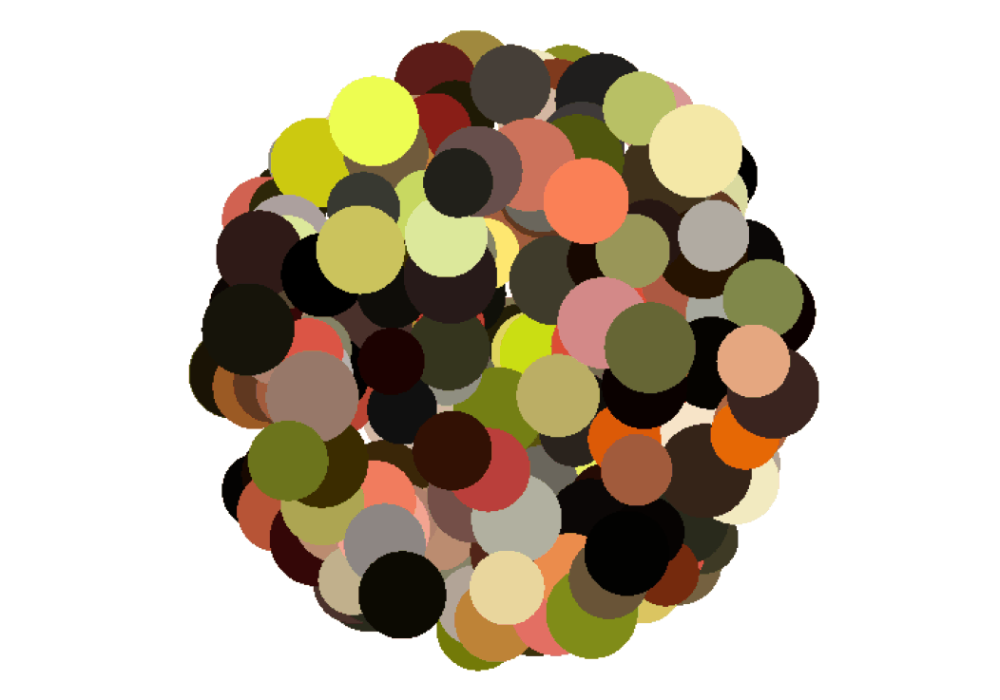

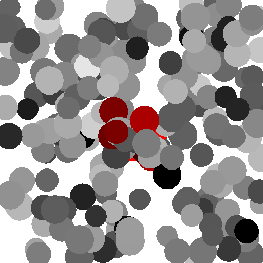
::::
:::::

Core features are
```{include} ../README.md
:start-line: 18
:end-line: 25
```

---

::::{grid} 2 
:gutter: 3

:::{grid-item-card} Get started 
:link: getting_started/installation 
:link-type: doc 
:text-align: center 
🚀 
^^^

Install `deadleaves` and follow an introductory tutorial 
:::

:::{grid-item-card} Learn more 
:link: user_guides/index 
:link-type: doc 
:text-align: center 
👨‍💻 
^^^

Learn more about design decisions and particular conventions and topics within `deadleaves` 
:::

:::{grid-item-card} Reference 
:link: reference/deadleaves/index 
:link-type: doc 
:text-align: center 
📖 
^^^

Look up functions and their specific parameters
:::

:::{grid-item-card} Get in touch, or contribute 
:link: development/contributing 
:link-type: doc 
:text-align: center 
📨, 🎁 
^^^

Ask a question, report a bug, request a feature, or contribute. 
::: 
::::

---

If you use `deadleaves` for scientific work, please cite the [paper](https://joss.theoj.org/papers/10.21105/joss.10531) as:

> Mahncke, S., Wallis, T. S. A., & Schmittwilken, L. (2026). deadleaves: Creating cluttered visual stimuli in Python. Journal of Open Source Software, 11(123), 6, [https://doi.org/10.21105/joss.10531](https://doi.org/10.21105/joss.10531)

Use this BibTeX entry for referencing:

```bibtex
@article{Mahncke2026, 
    doi = {10.21105/joss.10531}, 
    url = {https://doi.org/10.21105/joss.10531}, 
    year = {2026}, 
    publisher = {The Open Journal}, 
    volume = {11}, 
    number = {123}, 
    author = {Mahncke, Swantje and Wallis, Thomas S. A. and Schmittwilken, Lynn}, 
    title = {deadleaves: Creating cluttered visual stimuli in Python}, 
    journal = {Journal of Open Source Software}
} 
```

```{toctree}
:hidden:
:maxdepth: 2
:caption: Contents

getting_started/index
user_guides/index
Gallery <gallery/index>
Reference <reference/deadleaves/index>
Development <development/contributing>
```