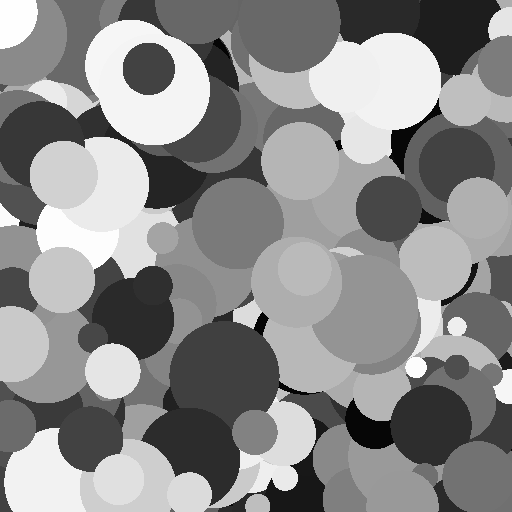

# User Guides

::::{grid} 2 
:gutter: 3

:::{grid-item-card} Shapes and Sizes
:link: shapes
:link-type: doc 
:text-align: center 


^^^

Check out the different leaf shapes.
:::

:::{grid-item-card} Distributions
:link: distributions
:link-type: doc 
:text-align: center 



^^^

See which distributions you can use to sample feature values.
:::

:::{grid-item-card} Colors
:link: colors 
:link-type: doc 
:text-align: center 


^^^

Make your images more colorful by sampling from different color spaces.
:::

:::{grid-item-card} Textures
:link: textures
:link-type: doc 
:text-align: center 


^^^

Add visual interest to each leaf by adding a texture.
:::

:::{grid-item-card} Partial sampling
:link: partial_sampling
:link-type: doc 
:text-align: center 


^^^

Reduce the number of leaves or exclude leaf positions from sampling. 
::: 

:::{grid-item-card} Dependencies
:link: dependencies
:link-type: doc 
:text-align: center 


^^^

Learn how to introduce feature dependencies into your model.
:::

:::{grid-item-card} Gallery
:link: ../gallery/index
:link-type: doc 
:text-align: center 


^^^

Check out the gallery for inspiration on how to combine these features to generate novel images.
::: 
::::

```{toctree}
:hidden:
:maxdepth: 1

shapes
colors
textures
partial_sampling
dependencies
distributions
```