# Summary

The Dead Leaves Model [@Matheron1968] has been used to create artificial images for visual experiments and as training data for machine learning for decades.
The model generates images by sampling objects from a given family of distributions and drawing them onto a canvas.
This generative process allows us to create images with various statistical properties, in particular we can vary some features while fixing others. 
`dead_leaves` is an open-source Python package build to create a variation of dead leaves images.
Core functionalities are:

- Generating dead leaves images with various leaf shapes (circles, ellipsoids, rectangles, regular polygons) and sizes.
- Sampling in different color spaces (RGB, HSV, Gray-scale) or directly from natural images.
- Applying textures to the leaves through a pixel-wise noise distribution or as texture-patches.
- Changing the area of the image covered by objects (sparse vs. dense sampling and position masks).
- Creating complex image configurations by including dependencies between object features.

The package is build around `PyTorch` [@Paszke2017] which allows the use of GPU for a much faster sampling process.
Users can plug in various distributions for the different model parameters to create a variety of images (@fig-DeadLeaves).

::: {#fig-DeadLeaves layout-ncol=6}
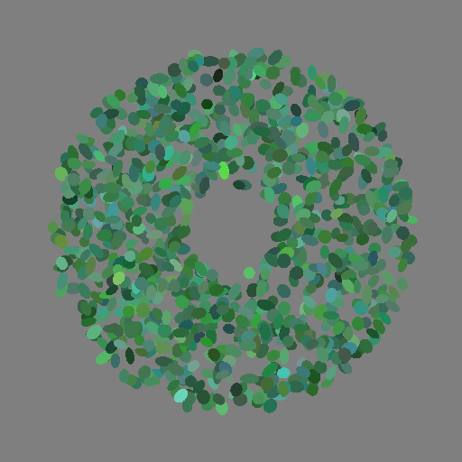{width=100%}

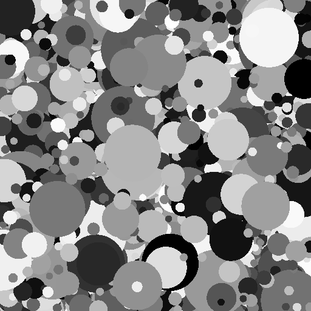{width=100%}

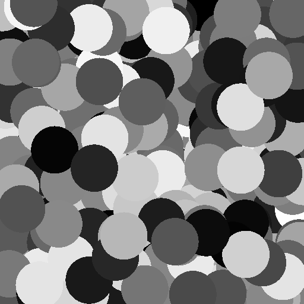{width=100%}

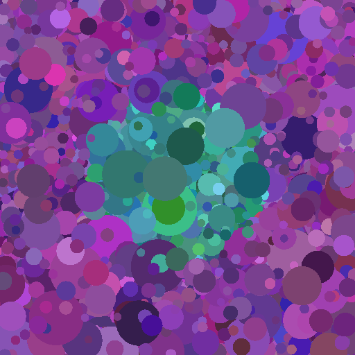{width=100%}

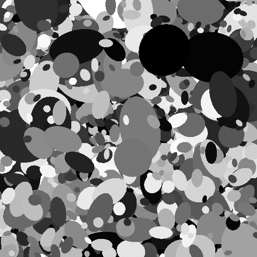{width=100%}

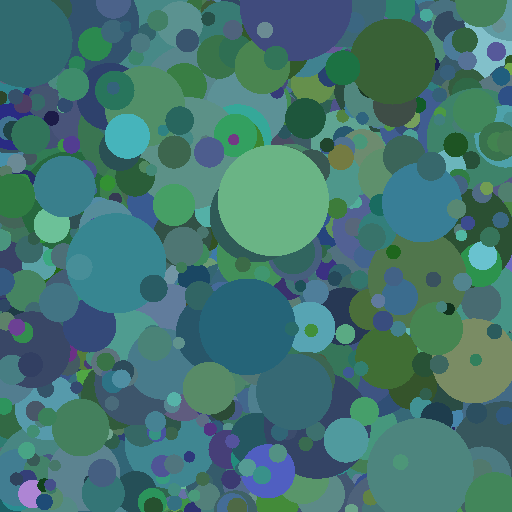{width=100%}

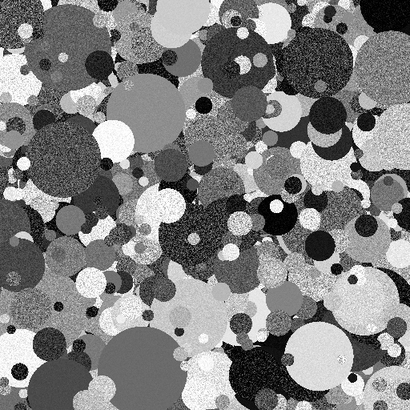{width=100%}

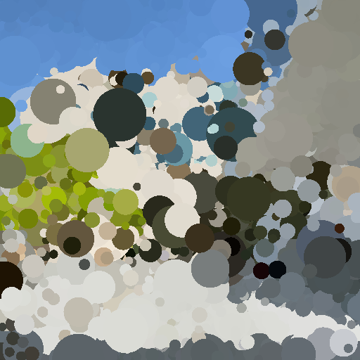{width=100%}

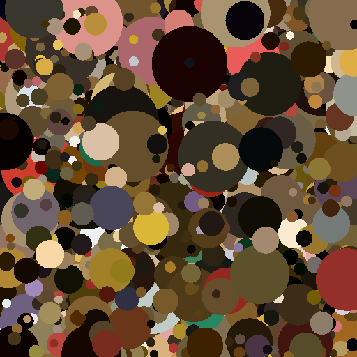{width=100%}

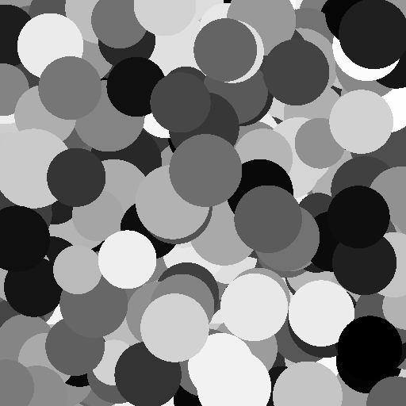{width=100%}

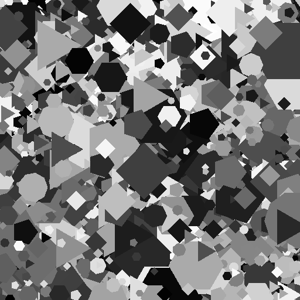{width=100%}

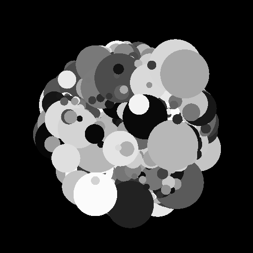{width=100%}

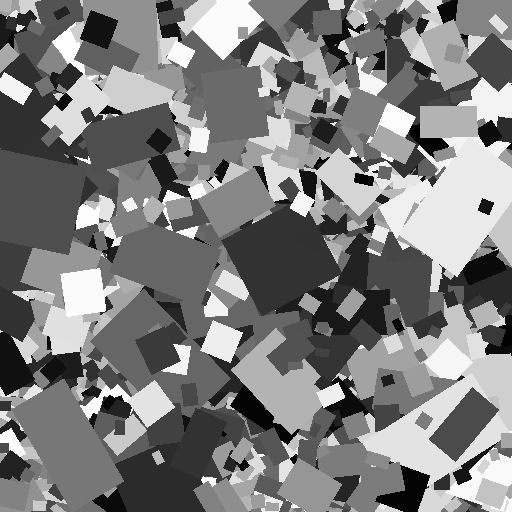{width=100%}

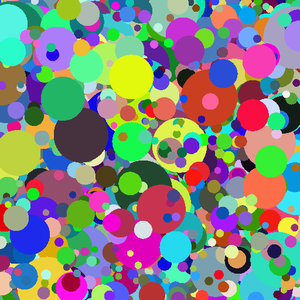{width=100%}

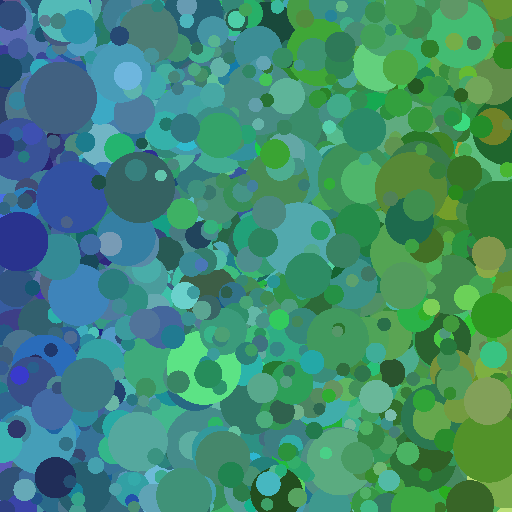{width=100%}

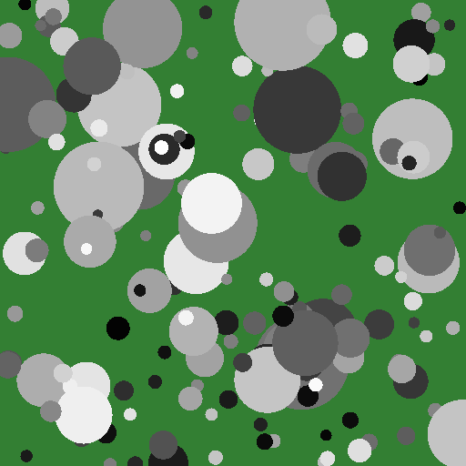{width=100%}

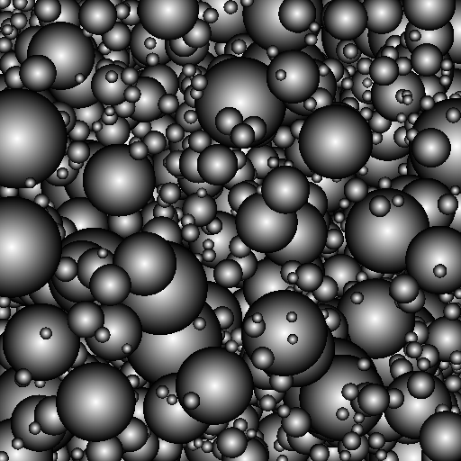{width=100%}

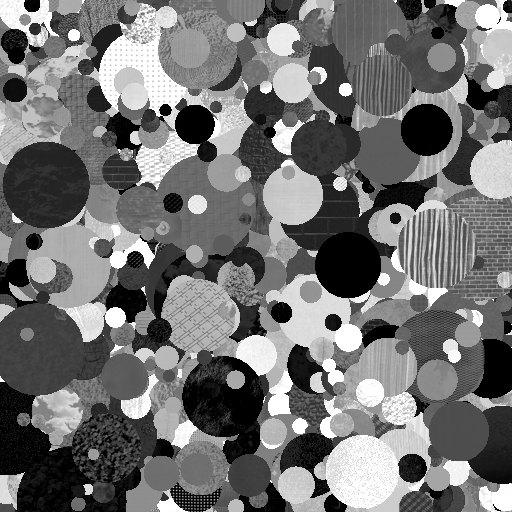{width=100%}

Images generated with the `dead_leaves` package.
:::

# State of the field

Variations of the dead leaves model have been used to create images for research in human and computer vision for many years (see next section).
The model provides a relatively simple way to generate complex cluttered stimuli which can match characteristic image statistics of natural images or custom distributions.
However, the generative code is implemented by each user from scratch and there are only a few projects using dead leaves images that made the code publicly available.
Additionally, in many works the specifications used to generate the images are only loosely given, such that replicating the stimuli is near to impossible.
Lastly, it is often unclear how the images are rendered in previous cases, which can have strong effects on the image statistics [@Achddou2022], which are often analyzed for dead leaves images.
To our knowledge there is no package for generating dead leaves images and we want to fill this gap by providing this package.

# Statement of need

We have identified three major areas in research where dead leaves images have been used in previous studies.
The main advantages of using dead leaves images in all cases is the option to generate images with some desired feature distribution, in particular those present in natural images which removes the dependence on natural images for some settings.

## 1. Study of image statistics
Many studies have analyzed the statistical properties of variations of dead leaves images with the goal of explaining regularities we can find in natural images through the properties of dead leaves images. 
A lot of work in this direction was done in the late 1990s and early 2000s. 
For example @Ruderman1997 argued that scaling in terms of the power spectrum in natural images can be explained by the presence of independent objects which have a power-law distribution of sizes, which he demonstrated using the dead leaves model. 
This work was build on by @Balboa2001 who used dead leaves images to study the effect of occlusion on scaling properties and extended by @Hsiao2005 and @Zylberberg2012 who analyzed the effect of occlusion on the power spectrum by varying leaf opacity. 
 
@Lee2001 further studied the statistics of dead leaves images empirically to show the similarity of the resulting contrast/derivative statistic to that of natural images which was later further improved through the addition of texture [@Madhusudana2022]. 
In particular, Lee et al. considered variations of the dead leaves model to generate images with difference statistics similar to images from different categories, e.g. *vegetation-like* vs. *man-made-like*.
Later @Pitkow2010 derived an analytical solution to compute the distribution of specific features in dead leaves images providing a direct link between the generative model and the resulting difference statistic.

Finally, Yann Gousseau and colleagues have done extensive work analysing the statistical properties of dead leaves models and extending the frame work [@Alvarez1999; @Gousseau2003; @Bordenave2006; @Gousseau2007].

## 2. Visual stimuli for human experiments

The experimental vision science take advantage of the found statistical properties by using dead leaves images as stimuli which replicate some desired feature distribution. 
In comparison to natural images they have the additional advantage that there are not semantic components.

The generated stimuli replicate specific color distributions [@Morimoto2021] to study luminosity thresholds, power spectra [@Kaping2007] to adapt participants to, and various contrast statistics [@Groen2012] which were used in a categorization task with the goal of studying rapid image categorization. 
@Taylor2015 and @Maiello2017 added blur either to parts of dead leaves images or to single leaves to study blur detection and discrimination.
Finally, @Wallis2012 embedded dead leaves into natural images to study the effects of crowding. 

## 3. Synthetic training data for neural networks

In recent years dead leaves models have been used to generate synthetic images to use as training data for the training of neural networks on disparity estimation [@Madhusudana2022], visual representations [@Baradad2021], and image restoration [@Achddou2022].

Apart from these three main use cases dead leaves images have for example also been used to measure texture quality on a digital camera [@Cao2010].
In conclusion there are many research areas for the application of dead leaves images and hence use cases for this package.

# Software Design

`dead-leaves` is designed to provide a user-friendly, object-oriented module for generating dead leaves images. 
The package is structured into two main classes which decouple the geometry from the rendering process.

The geometry is generate in an interative process.
In each iteration $i$ we sample a uniform position $(x,y)$ on our canvas and shape parameters for the chosen shape, e.g. the area of a circle.
The resulting object is what we call the leaf with index $i$. 
Any pixel on our canvas which does not already belong to a leaf and is cover by our leaf $L_i$ will be labeled as $i$, i.e. we layer object from front to back onto our canvas.
We repeat this process for a given number of steps `n_samples` or until a given area is filled, either the full canvas or some specific unmasked area.
As a result we get a segmentation or partition map `partition` of the canvas where each point belongs to exactly one leaf or the background.

The rendering is then performed by sampling a color (and optionally texture) for each leaf from a given color (or texture) distribution and coloring the corresponding pixels of the canvas.
Rendering the image by coloring pixels based on their object membership leads to a pixel perfect segmentation of the generated image, i.e. sharp edges.
This generative process does not allow for decorations like blur or transparency.
Both classes contain modular components which are plugged into the classes main methods such that it can fairly simple be extended to other geometries or rendering specifications.

# Research Impact Statement

The `dead-leaves` package allows to generate dead leaves images in a user friendly and well documented way.
Many of the images used in the research listed before can be generated with our package.
Since this model has been in use for research for decades and is still continuously used we expect this package to support more research along approaches covered so far.
In addition, the `dead_leaves` package could be used to easily generate image with similar statistics to those of natural images as control stimuli for aesthetics research or for studying how different features are integrated in human perception (e.g. luminance and hue).

# AI usage disclosure

Generative AI was used to aid in the setup of the documentation and for generating test cases for the package components.
No AI output was directly copied for usage. 
All AI output was adjusted manually to fit the desired setting and be functional.

# Acknowledgements

This work was supported by the Deutsche Forschungsgemeinschaft (German Research Foundation, DFG) under Germany’s Excellence Strategy (EXC 3066/1 “The Adaptive Mind”, Project No. 533717223).
This work was co-funded by the European Union (ERC, SEGMENT, 101086774). Views and opinions expressed are however those of the author(s) only and do not necessarily reflect those of the European Union or the European Research Council. Neither the European Union nor the granting authority can be held responsible for them.

# References

